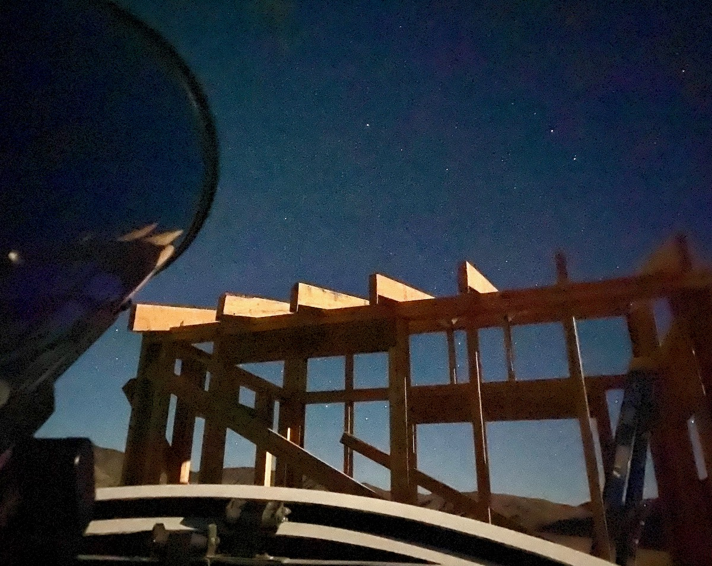

# Deep Springs Observatory

*The construction of the Deep Springs observatory was made possible by the enthusiasm and generosity of the Deep Springs Class of '77.*

## Dome and Control Room

The observatory's dome is the [Aphelion 7 ft Model](https://www.apheliondomes.com/products.html) purchased used from [Antelope Hills Observatory](http://www.antelopehillsobservatory.org). The height inside has been increased to 81&frac12;&rdquo; by bolting the dome to a 24-sided sill plate on top of a 12-sided concrete riser.

The control room for the observatory became usable (but not finished out) in time for the Term 5, 2022 [Observational Astronomy](../observational-astronomy) course. Below is Polaris (top center) and the rest of Ursa Minor stretching to the right over the moonlit rafters of the control room when it was still being framed:

## Power

Field power for the equipment is provided by two [Jackery Explorer 1000s](https://www.jackery.com/products/explorer-1000-portable-power-station) which are kept charged by two [Jackery SolarSaga 100s](https://www.jackery.com/products/solarsaga-100w-solar-panel). Industrial grade PVC conduit for carrying data and power is routed underground between the dome and the control room.

## Instrument

Saint Mary's College donated one of its surplus [Meade LX200 Classic 10&rdquo;](./resources/LX200_Classic_Manual.pdf) telescopes to Deep Springs College:

The telescope's optical tube assembly (OTA) was de-forked and modified to ride on a [Losmandy G11G](http://www.losmandy.com/g-11.html):

The Saint Mary's College donation included a Meade 40mm 2&rdquo; eyepiece. It takes in about 3/4&deg; of the sky at 63.5x power.

## Program

With the clear, dark skies and high elevation at Deep springs, students will be able to use the dome, telescope, and control room to do a wide variety of pedagogically and scientifically valuable projects.

## Related Links

* Dark Site Finder [screenshot centered on Deep Springs](./resources/DarkSiteFinderDeepSprings.png)
* Collection of local forecasts on Brian Hill's [home page](../index.html#weather-forecasts)
