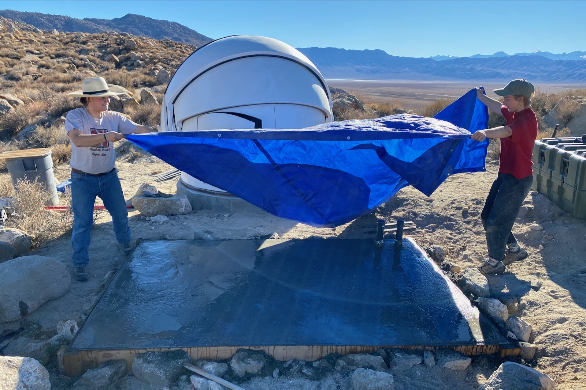

# Deep Springs Observatory

*The construction of the Deep Springs observatory is being made possible by the enthusiasm and generosity of the Deep Springs Class of '77.*

## Links

* Collection of local forecasts on Brian Hill's [home page](../index.html#weather-forecasts)
* Dark Site Finder [light pollution map](https://darksitefinder.com/maps/world.html#10/37.3749/-117.9802) centered on Deep Springs

## Dome and Control Room

As of November, 2021 the dome is completed and the 6'x9' slab for the control room has been poured:

The dome is an [Aphelion Observatory (7 ft model)](https://www.apheliondomes.com/products.html) purchased used from [Antelope Hills Observatory](http://www.antelopehillsobservatory.org) in Bennett, Colorado. The control
room will have space for two people to work side-by-side, and a small amount of equipment storage. Conduit for USB and power cables connects the dome and the control room.

## Optics

The dome will house a [Celestron EdgeHD 11](https://www.celestron.com/products/edgehd-11-optical-tube-assembly-cge-dovetail) Schmidt astrograph:

The features of the EdgeHD are documented in Celestron's [white paper](./resources/CelestronEdgeHDWhitePaper.pdf) and [instruction manual](./resources/CelestronEdgeHDInstructionManual.pdf). As one of its capabilities, it can be operated as a [Rowe-Ackerman Schmidt-Astrograph](./resources/RASAWhitePaper.pdf).

## Mount

The EdgeHD 11 will be carried by a [Losmandy G11G](http://www.losmandy.com/g-11.html):

## Power

Field power for the telescopes and their associated electronics will be provided by two [Jackery Explorer 1000s](https://www.jackery.com/products/explorer-1000-portable-power-station) which will be kept charged by a bank of four solar panels. 

## Program

With the clear, dark skies and high elevation at Deep springs, and using astronomical filters and modern CMOS cameras, students will be able to do a wide variety of pedagogically and scientifically valuable projects, including spectroscopy, exoplanet observation, and [astrophotography](../astronomy/index.html#astrophotography-projects).
