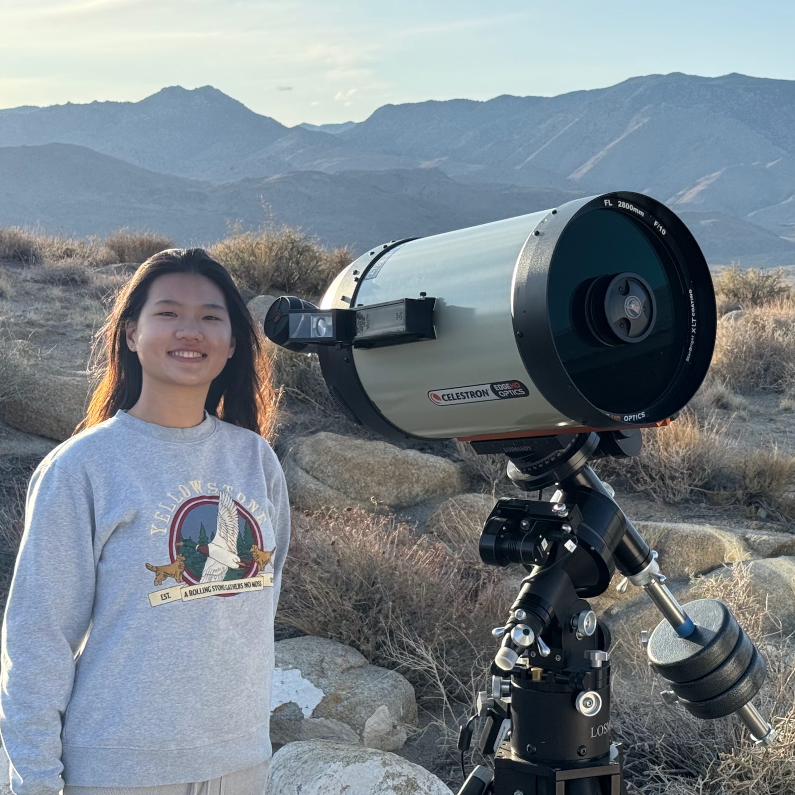

# Deep Springs Observatory

*Construction of the observatory was made possible by the enthusiasm and generosity of the Deep Springs Class of '77.*

## Dome and Control Room

The observatory's dome is the [Aphelion 7 ft Model](./resources/plans/DomeCrossSection.gif) purchased used from [Antelope Hills Observatory](http://www.antelopehillsobservatory.org). The height inside the dome was increased slightly by putting it on a custom 12-sided foundation. The control room is also a [custom design](./resources/plans/index.html).

Field power for the equipment is provided by two [Jackery Explorer 1000s](https://www.jackery.com/products/explorer-1000-portable-power-station) which are kept charged by two [Jackery SolarSaga 100s](https://www.jackery.com/products/solarsaga-100w-solar-panel). Industrial grade PVC conduit for carrying data and power is routed underground between the dome and the control room.

## Telescope

At the beginning of 2024, the main instrument of the observatory was upgraded to a [Celestron Edge HD 11](./resources/equipment/CelestronEdgeHDWhitePaper.pdf) with a gift from Dr. J. Hugh Visser. Below, Hexi Jin, DS23, sets up the telescope outside the dome for easy access before a June, 2025 astronomy night:

The optical tube assembly (OTA) rides on a [Losmandy G11G](http://www.losmandy.com/g-11.html) mount.

## Milestones

In January of 2021, the gift from Deep Springs Class of '77 was made, preparing the way for construction of the dome in that spring.

The observatory went into service for the Term 5 Observational Astronomy course held in March and April of 2022. However, much remained to be completed at that time. The observatory became operational for research in October of 2022 when the custom desk and shelving were installed in the control room.

Six months later, in April of 2023, a significant upgrade inside the dome from a tripod to a [30" Paramount permanent pier](https://www.bisque.com/product/mx-pier/) was made. The pier sits on a concrete pedestal that rises 6" above the floor and extends 26" below the floor and touches granite. The pier was drilled and tapped with the help of Stephan Bork so that it can support either a Losmandy G11G or a Paramount MYT. Replacing the heavy-duty tripod with a permanent pier almost entirely eliminates the need for occasional recalibration of the telescope's orientation.

With the College's [clear](./resources/site/USDrearyDays.jpeg) and [dark](./resources/site/DarkSiteFinder.png) skies (which despite the growth of Bishop until recently [were rated](./resources/site/BortleClass1.png) as Bortle Class 1), and the 5530' (1685m) elevation at the observatory, students are able to use the dome, telescope, and control room to do a wide variety of pedagogically- and scientifically-valuable work, including spectroscopy, observation of transient phenomena, and astrophotography projects.

In January of 2024, the main instrument was upgraded and several complementary accessories were purchased with a gift from Dr. J. Hugh Visser.

## Links

* Collection of [local forecasts](../index.html#weather-forecasts) on Brian Hill's home page
* Term 5 2022 [Observational Astronomy](../observational-astronomy/index.html) course
* Terms 3-5 2022-2023 [Transient Astronomy](../transient-astronomy/index.html) directed study and research with Luke Suess (DS 21) and Sofia Mikulasek (DS 22)
* Terms 4-5 2024-2025 [Supernova Observation](../supernova-observation/index.html) directed study and research with Ethan Liao (DS 22) and Hexi Jin (DS 23)
