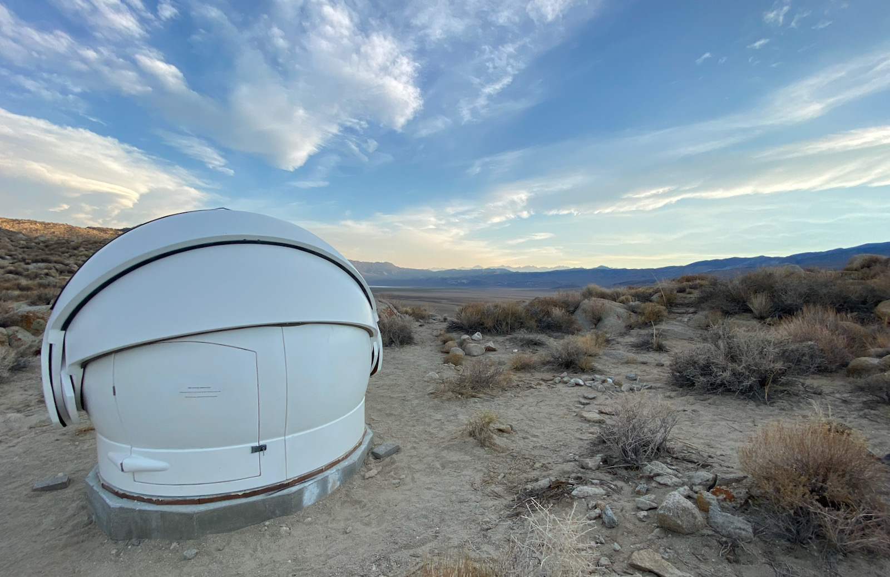
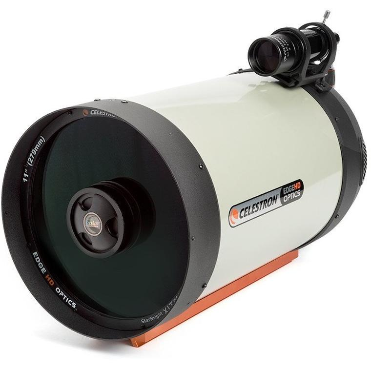
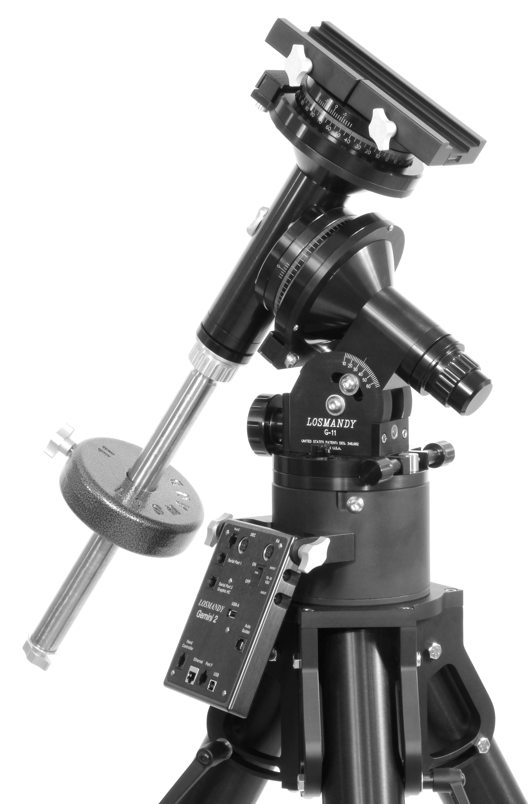

# Deep Springs Observatory

*The construction of the Deep Springs observatory is being made possible by the enthusiasm and generosity of the Deep Springs Class of '77.*

## Links

* Collection of local forecasts on Brian Hill's [home page](../index.html#weather-forecasts)
* Dark Site Finder [light pollution map](https://darksitefinder.com/maps/world.html#10/37.3749/-117.9802) centered on Deep Springs

## Dome

Construction of the dome was completed in June of 2021:

The foundation was custom-designed to support an [Aphelion Observatory Dome (7 ft model)](https://www.apheliondomes.com/products.html) purchased used from Antelope Hills Observatory in Bennett, Colorado.

## Field Station

The dome is just large enough to house a telescope. Two people can stand beside the telescope for visual observing, but for CMOS imaging, the dome is not designed for people to be inside doing extended work while the telescope is operating.

In the fall of 2021, construction will begin for the adjacent field station. This is a data-taking room that will be large enough for two people to work for hours while the telescope is acquiring images.

## Optics

The dome will house a [Celestron EdgeHD 11](https://www.celestron.com/products/edgehd-11-optical-tube-assembly-cge-dovetail) Schmidt astrograph:

The features of the EdgeHD are documented in Celestron's [white paper](./resources/CelestronEdgeHDWhitePaper.pdf) and [instruction manual](./resources/CelestronEdgeHDInstructionManual.pdf). As one of its capabilities, it can be operated as a [Rowe-Ackerman Schmidt-Astrograph](./resources/RASAWhitePaper.pdf).

## Mount

The EdgeHD 11 will be carried by a [Losmandy G11G](http://www.losmandy.com/g-11.html):

## Power

Field power for the telescopes and their associated electronics will be provided by two [Jackery Explorer 1000s](https://www.jackery.com/products/explorer-1000-portable-power-station) which will be kept charged by a bank of four solar panels. 

## Program

When coupled with astronomical filters and modern CMOS cameras a wide variety of scientifically and pedagogically valuable projects will be possible.
