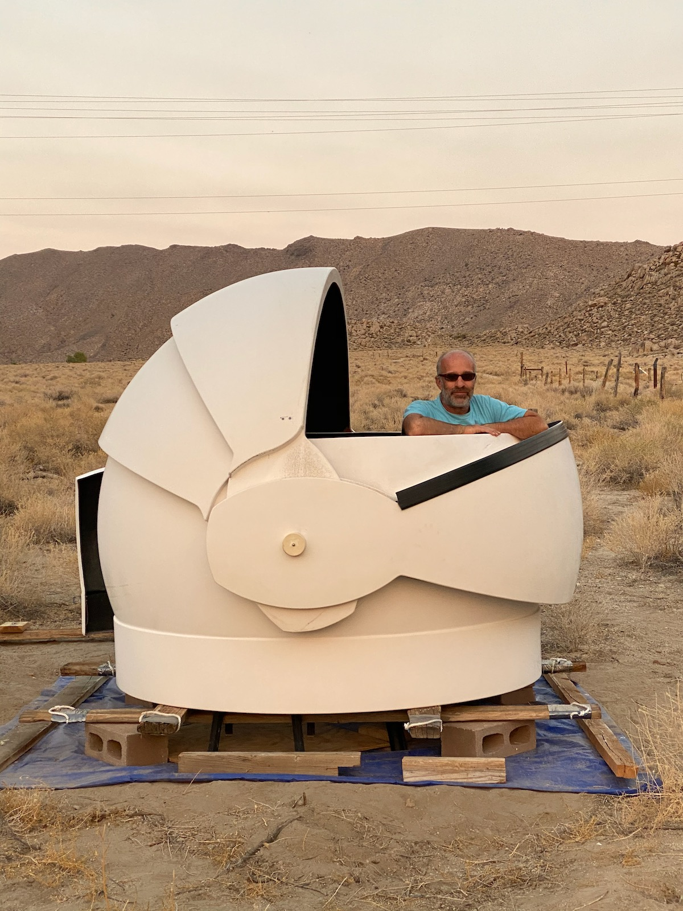
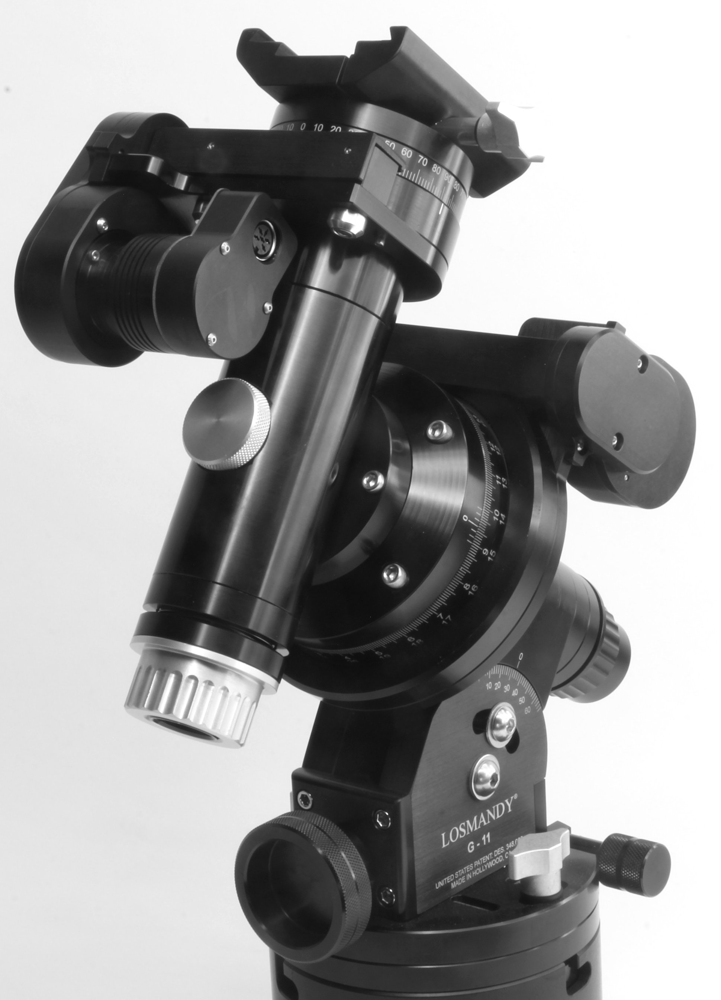

# Deep Springs Observatory

## Site

The observatory foundation is under construction and is expected to be at least partially operable in Spring 2021

The foundation will secure and support an Aphelion (previously branded as Galactica) 7' clamshell dome:

The dome is shown with [the author](../) inside. It will remain stored on bricks and a pallet until the foundation is complete.

## Instrument

The dome was chosen to protect a CFF 250mm f/8 Ritchey-Chr&eacute;tien reflector:

The 250mm will ride on a Paramount MYT:

A Software Bisque [pier](https://www.bisque.com/product/mx-pier/) will be set in the center of the dome after the perimeter foundation is completed.

## Portable Instrument

Students gain experience using a Stellarvue 130mm f/7 triplet apochromat refractor:

The 130mm rides on a Losmandy GM811G:

The Stellarvue 130mm and the Losmandy GM811G are set up on a Losmandy HD tripod and the combination is readily portable.
