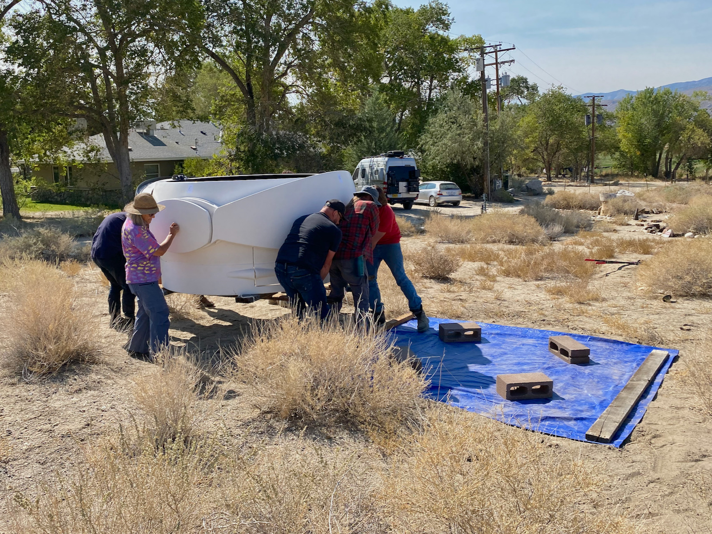
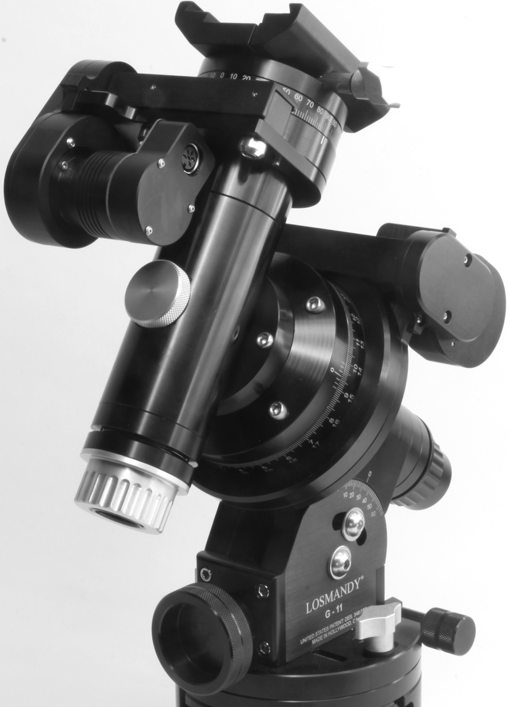

# Deep Springs Observatory

## Links

* Brian Hill [Home](/)
* Astronomical [light pollution map](https://darksitefinder.com/maps/world.html#10/37.3749/-117.9802) centered on Deep Springs
* ClearDarkSky [astronomical forecast](https://www.cleardarksky.com/c/DpSprObCAkey.html?1) for Deep Springs Observatory
* Astrospheric [astronomical forecast](https://www.astrospheric.com/?Latitude=37.3749&Longitude=-117.9802) for Deep Springs Observatory

## Dome

Excavation for a foundation is underway and the observatory is expected to be at least partially operable in Spring 2021:

The foundation will secure and support an Aphelion [7 ft clamshell dome](https://www.apheliondomes.com/products.html) purchased used from Antelope Hills Observatory in Bennett, Colorado:

Above, faculty and students in October, 2020 moving the dome to where it is presently stored and awaiting a helicopter lift to the ridge.

## Primary Instrument

The dome will protect a CFF 250mm f/8 Ritchey-Chr&eacute;tien reflector:

The CFF RC250 is shouldered by a Software Bisque [Paramount MYT](https://www.bisque.com/product/paramount-myt-portable-robotic-telescope-mount/):

A Software Bisque [pier](https://www.bisque.com/product/mx-pier/) will be set in the center of the dome after the perimeter foundation is completed.

## Portable Instrument

Students will gain experience using a Stellarvue SVA130T f/7 triplet apochromat refractor:

The SVA130T is the predecessor of the Stellarvue [SVX130T](https://www.stellarvue.com/svx130t/)). For scientific and astrophotography uses, the SVA130T is paired with a Stellarvue [SFFRR.72 Reducer/Flattener](https://www.cameraconcepts.com/stellarvue-stellarvue-sffr72-130-25-48-reducer-fla.html), resulting in an f/5 effective focal ratio.

The SVA130T rides on a Losmandy GM811G:

A Losmandy [HD tripod](http://store.losmandy.com/fhd-ma) supports the GM811G, and the scope, mount, and tripod are reasonably portable. The SVA130T can be taken to exceptional nearby sites such as the White Mountain Research Center [Barcroft Station](https://www.wmrc.edu/facilities/bar/default.html).

## Power

Field power when using either the CFF RC250 or the Stellarvue SVA130T, and their mounts and associated electronics is provided by a Jackery [Explorer 1000](https://www.jackery.com/products/explorer-1000-portable-power-station).
