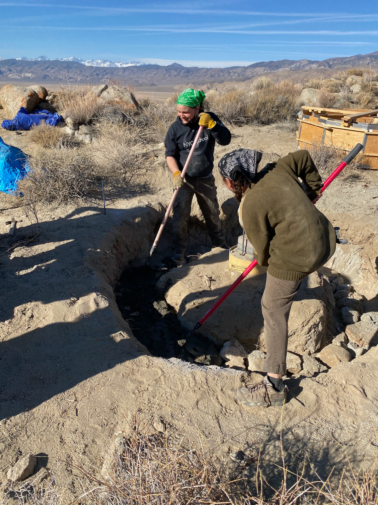

# Deep Springs Observatory

*The construction of the Deep Springs observatory is being made possible by the enthusiasm and generosity of the Deep Springs Class of '77.*

## Links

* Collection of local forecasts on Brian Hill's [home page](../index.html#weather-forecasts)
* Dark Site Finder [light pollution map](https://darksitefinder.com/maps/world.html#10/37.3749/-117.9802) centered on Deep Springs

## Dome

Construction of a foundation for the dome has begun and the observatory is expected to be at least partially operable in May of 2021:

The foundation will secure and support an Aphelion [Observatory Dome (7 ft model)](https://www.apheliondomes.com/products.html) purchased used from Antelope Hills Observatory in Bennett, Colorado.

## Optics

The dome will house a [Celestron EdgeHD 11](https://www.celestron.com/products/edgehd-11-optical-tube-assembly-cge-dovetail) Schmidt astrograph:

The features of the EdgeHD are documented in Celestron's [white paper](./resources/CelestronEdgeHDWhitePaper.pdf) and [instruction manual](./resources/CelestronEdgeHDInstructionManual.pdf). In particular, it can be operated as a [Rowe-Ackerman Schmidt-Astrograph](./resources/RASAWhitePaper.pdf).

## Mount

The Edge HD 11 will be carried by a [Losmandy G11G](http://www.losmandy.com/g-11.html):

## Power

Field power for the telescopes and their associated electronics will be provided by a [Jackery Explorer 1000](https://www.jackery.com/products/explorer-1000-portable-power-station). The Jackery Explorer 1000 will in turn be charged by a [Jackery SolarSaga 100W Solar Panel](https://www.jackery.com/products/solarsaga-100w-solar-panel) mounted near the dome.

## Program

When coupled with astronomical filters and modern CMOS cameras a wide variety of scientifically and pedagogically valuable projects will be possible.
