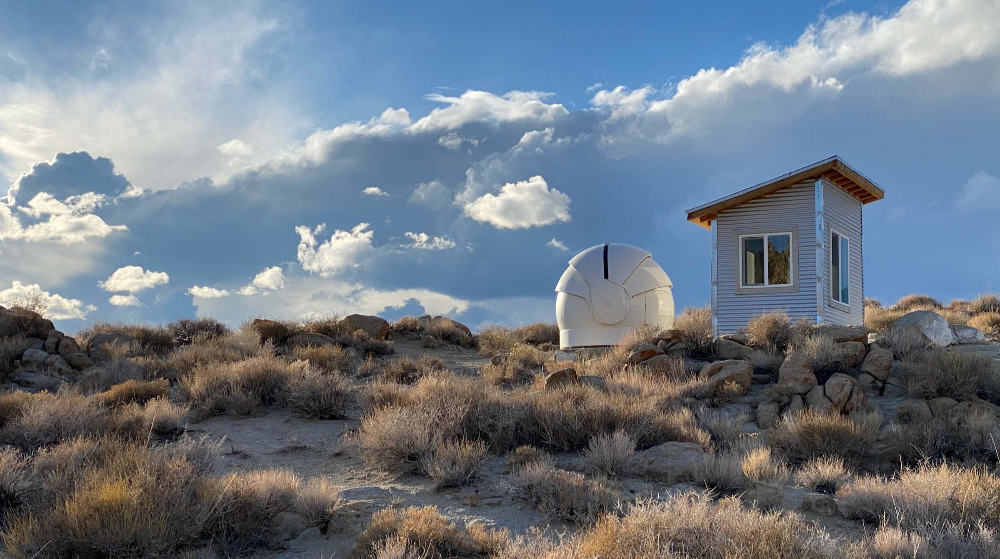

# Deep Springs Observatory

*The construction of the Deep Springs observatory was made possible by the enthusiasm and generosity of the Deep Springs Class of '77.*

## Dome and Control Room

The observatory's dome is the [Aphelion 7 ft Model](./resources/plans/DomeCrossSection.gif) purchased used from [Antelope Hills Observatory](http://www.antelopehillsobservatory.org). The height inside the dome was increased slightly by putting it on a custom [12-sided foundation](./resources/plans/index.html).

The observatory went into service for the Term 5 Observational Astronomy course held in March and April of 2022, even though much remained to be completed at that time. It became fully operational in October of 2022 when the custom desk and shelving were installed in the control room.

## Power

Field power for the equipment is provided by two [Jackery Explorer 1000s](https://www.jackery.com/products/explorer-1000-portable-power-station) which are kept charged by two [Jackery SolarSaga 100s](https://www.jackery.com/products/solarsaga-100w-solar-panel). Industrial grade PVC conduit for carrying data and power is routed underground between the dome and the control room.

## Instrument

Saint Mary's College of California donated a [Meade LX200 Classic 10&rdquo;](./resources/equipment/LX200_Classic_Manual.pdf) telescope:

The telescope's optical tube assembly (OTA) was de-forked to ride on a [Losmandy G11G](http://www.losmandy.com/g-11.html):

The Saint Mary's College donation included a Meade 40mm 2&rdquo; eyepiece which takes in about 3/4&deg; of the sky at 63.5x power.

## Program

With the College's [clear](./resources/site/USDrearyDays.jpeg) and [dark](./resources/site/DarkSiteFinder.png) skies (which despite the growth of Bishop until recently [were rated](./resources/site/BortleClass1.png) as Bortle Class 1), and the 5530' (1685m) elevation at the observatory, students are able to use the dome, telescope, and control room to do a wide variety of pedagogically- and scientifically-valuable work, including spectroscopy, observation of transient phenomena, and astrophotography projects.

## Links

* Collection of [local forecasts](../index.html#weather-forecasts) on Brian Hill's home page
* Term 5 2022 [Observational Astronomy](../observational-astronomy/index.html) course
* Terms 3-5 2022-2023 [Transient Astronomy](../transient-astronomy/index.html) directed study and research
