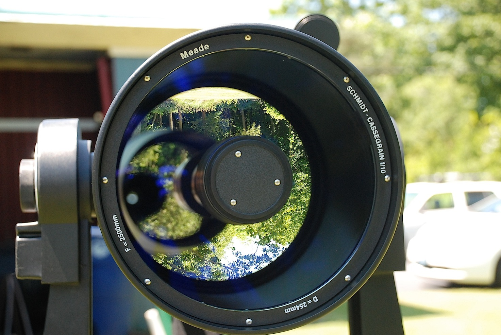

# Deep Springs Observatory

*The construction of the Deep Springs observatory is being made possible by the enthusiasm and generosity of the Deep Springs Class of '77.*

## Links

* Collection of local forecasts on Brian Hill's [home page](../index.html#weather-forecasts)
* Dark Site Finder [screenshot centered on Deep Springs](./resources/DarkSiteFinderDeepSprings.png) (see also Dark Site Finder [interactive map](https://darksitefinder.com/maps/world.html#10/37.3749/-117.9802))

## Dome and Control Room

The control room for the observatory is on track to be usable (but not finished out) in time for the beginning of Term 5 (March 14, 2022) when the first observational astronomy course
begins. Below is Polaris (top center) and the rest of Ursa Minor stretching to the right over the moonlit rafters of the control room:

The rafter pitch is set to the (7, 24, 25) Pythagorean triple, more commonly known to builders as 3&frac12;:12 pitch.

The observatory's dome is the [Aphelion 7 ft Model](https://www.apheliondomes.com/products.html) purchased used from [Antelope Hills Observatory](http://www.antelopehillsobservatory.org). The  usable height inside has been increased to 81&frac12;&rdquo; by bolting the dome to a 24-sided sill plate, which is itself secured with 48 wedge anchors to a 12-sided concrete riser.

## Instrumentation

The Saint Mary's College Geissberger Observatory has donated one of their [Meade LX200 EMC 10&rdquo;](./resources/LX200_Classic_Manual.pdf) telescopes:

The telescope's optical tube assembly (OTA) has been de-forked and modified to ride on a [Losmandy G11G](http://www.losmandy.com/g-11.html):

A [ZWO ASI 2600 MC Pro](https://astronomy-imaging-camera.com/product/asi2600mc-pro-color) astronomy imaging camera that had been in use for SETI searches has been donated by Space Laser Awareness.

Thanks to the very substantial savings afforded by these donations, there will be budget to select additional equipment to round out the instrumentation.

## Power

Field power for the telescope, its camera, and the computers that control them will be provided by two [Jackery Explorer 1000s](https://www.jackery.com/products/explorer-1000-portable-power-station) which will be kept charged by two [SolarSaga 100 panels](https://www.jackery.com/products/solarsaga-100w-solar-panel). Industrial grade PVC conduit for carrying data and power is routed underground between the dome and the control room.

## Program

With the clear, dark skies and high elevation at Deep springs and a modern CMOS camera, students will be able to use the dome, telescope, and control room to do a wide variety of pedagogically and scientifically valuable projects.
