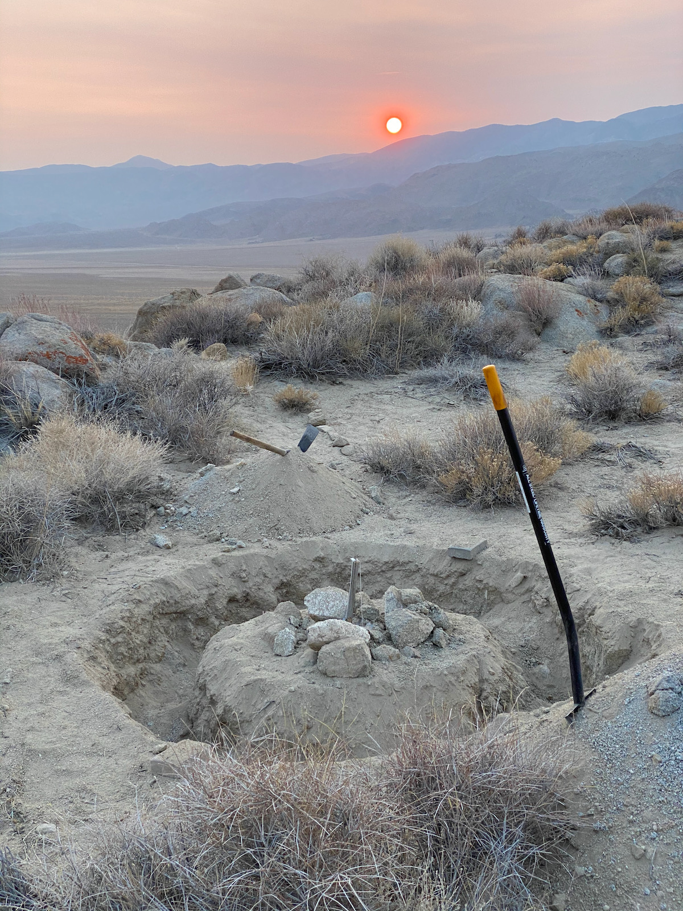

# Deep Springs Observatory

## Site

The observatory is under construction and is expected to be at least partially operable in Spring 2021

## Instrument

The principal instrument is an f/8 250mm Ritchey-Chr&eacute;tien reflector made by CFF Telescopes

Students begin by learning to use an f/7 130mm triplet apochromat refractor made by Stellarvue

## Mount

The 250mm scope rides on a Paramount MYT

