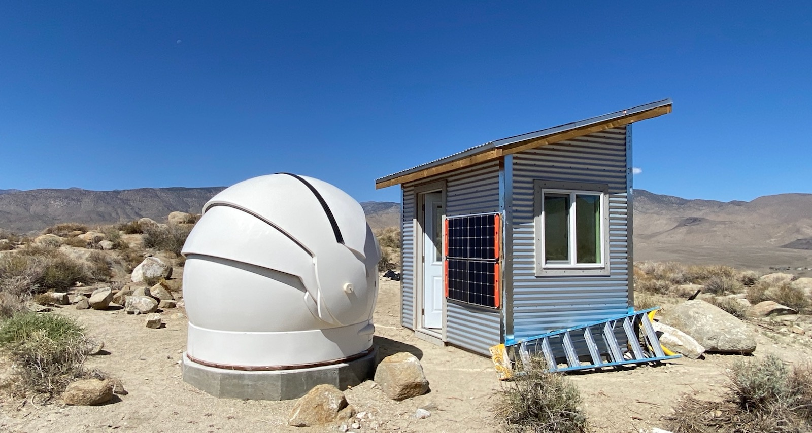

# Deep Springs Observatory

*The construction of the Deep Springs observatory was made possible by the enthusiasm and generosity of the Deep Springs Class of '77.*

## Dome and Control Room

The observatory's dome is the [Aphelion 7 ft Model](./resources/plans/DomeCrossSection.gif) purchased used from [Antelope Hills Observatory](http://www.antelopehillsobservatory.org). The internal height inside the dome was increased by 9&frac12;&rdquo; to 81&frac12;&rdquo; by putting it on a custom [12-sided foundation](./resources/plans/index.html).

The observatory went into service for the Term 5 Observational Astronomy course held in March and April of 2022. Construction was completed when the control room was fully sheathed in September, 2022:

## Power

Field power for the equipment is provided by two [Jackery Explorer 1000s](https://www.jackery.com/products/explorer-1000-portable-power-station) which are kept charged by two [Jackery SolarSaga 100s](https://www.jackery.com/products/solarsaga-100w-solar-panel). Industrial grade PVC conduit for carrying data and power is routed underground between the dome and the control room.

## Instrument

Saint Mary's College donated one of its surplus [Meade LX200 Classic 10&rdquo;](./resources/equipment/LX200_Classic_Manual.pdf) telescopes to Deep Springs College:

The telescope's optical tube assembly (OTA) was de-forked to ride on a [Losmandy G11G](http://www.losmandy.com/g-11.html):

The Saint Mary's College donation included a Meade 40mm 2&rdquo; eyepiece. It takes in about 3/4&deg; of the sky at 63.5x power.

## Program

With the College's [clear](./resources/site/USDrearyDays.jpeg) and [dark](./resources/site/DarkSiteFinder.png) skies (which despite the growth of Bishop until recently [were rated](./resources/site/BortleClass1.png) as Bortle Class 1), and the 5530' (1685m) elevation at the observatory, students will be able to use the dome, telescope, and control room to do a wide variety of pedagogically- and scientifically-valuable work, including spectroscopy, observation of transient phenomena, and astrophotography projects.

## Links

* Collection of [local forecasts](../index.html#weather-forecasts) on Brian Hill's home page
* March and April 2022 [Observational Astronomy](../observational-astronomy/index.html) course
