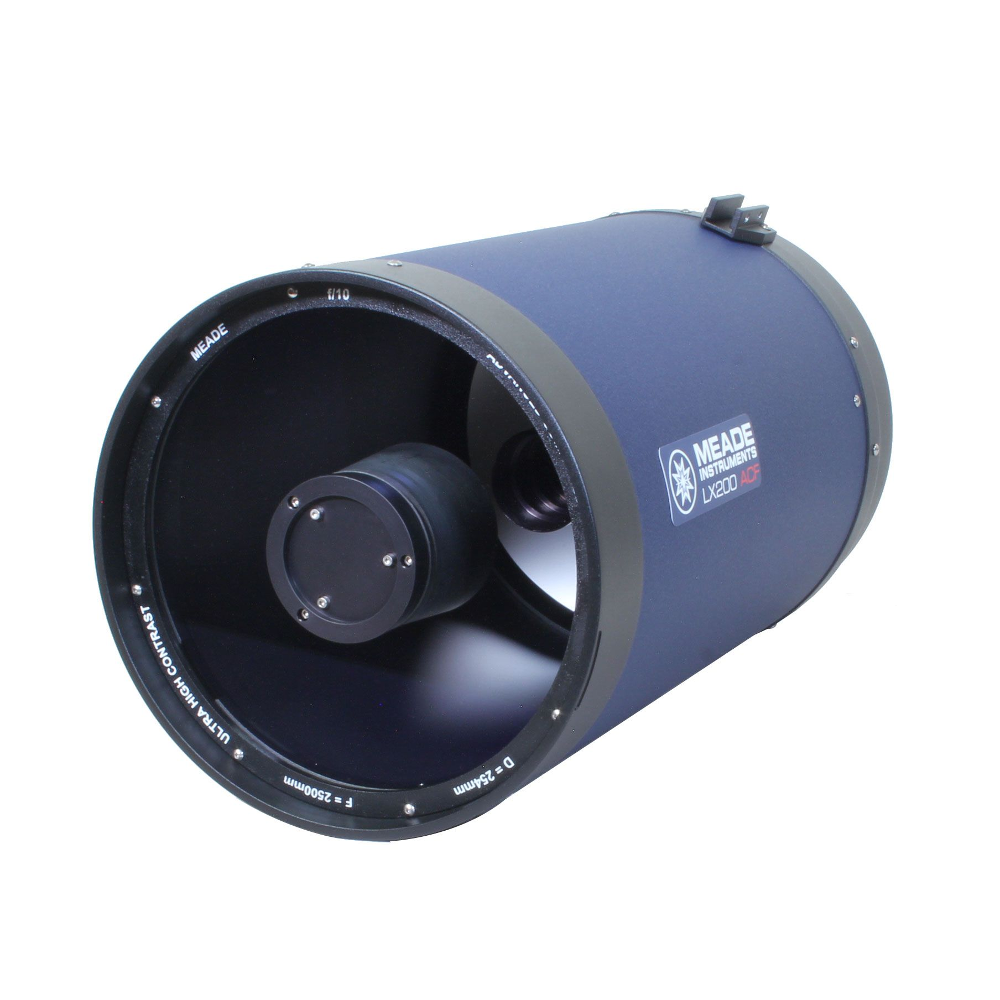

# Deep Springs Observatory

*The construction of the Deep Springs observatory is being made possible by the enthusiasm and generosity of the Deep Springs Class of '77.*

## Links

* Collection of local forecasts on Brian Hill's [home page](../index.html#weather-forecasts)
* Dark Site Finder [screenshot centered on Deep Springs](./resources/DarkSiteFinderDeepSprings.png) (see also Dark Site Finder [interactive map](https://darksitefinder.com/maps/world.html#10/37.3749/-117.9802))

## Dome and Control Room

As of February, 2022 the framing of the 6'x9' control room has begun.

The dome is an [Aphelion Observatory (7 ft model)](https://www.apheliondomes.com/products.html) purchased used from [Antelope Hills Observatory](http://www.antelopehillsobservatory.org) in Bennett, Colorado. The control room will be an attractive space for two people to work side-by-side with a small amount of equipment storage. Conduit intended to carry USB and power cables connects the dome and the control room.

## Optics

Depending upon availability, the dome will house either a [Meade LX200 10](https://www.meade.com/lx200-acftm-10-f-10-ota-only.html) or a [Celestron EdgeHD 11](https://www.celestron.com/products/edgehd-11-optical-tube-assembly-cge-dovetail).

Meade OTA (optical tube assembly):

Celestron OTA:

## Mount

The OTA will be carried by a [Losmandy G11G](http://www.losmandy.com/g-11.html):

## Power

Field power for the telescopes and their associated electronics will be provided by two [Jackery Explorer 1000s](https://www.jackery.com/products/explorer-1000-portable-power-station) which will be kept charged by a bank of four solar panels. 

## Program

With the clear, dark skies and high elevation at Deep springs, and using astronomical filters and modern CMOS cameras, students will be able to use the dome, telescope, and control room do a wide variety of pedagogically and scientifically valuable projects, including spectroscopy, exoplanet observation, and [astrophotography](../astronomy/index.html#astrophotography-projects). The first observational astronomy class will be in Term 5 (mid-March to beginning of May) of 2022.
