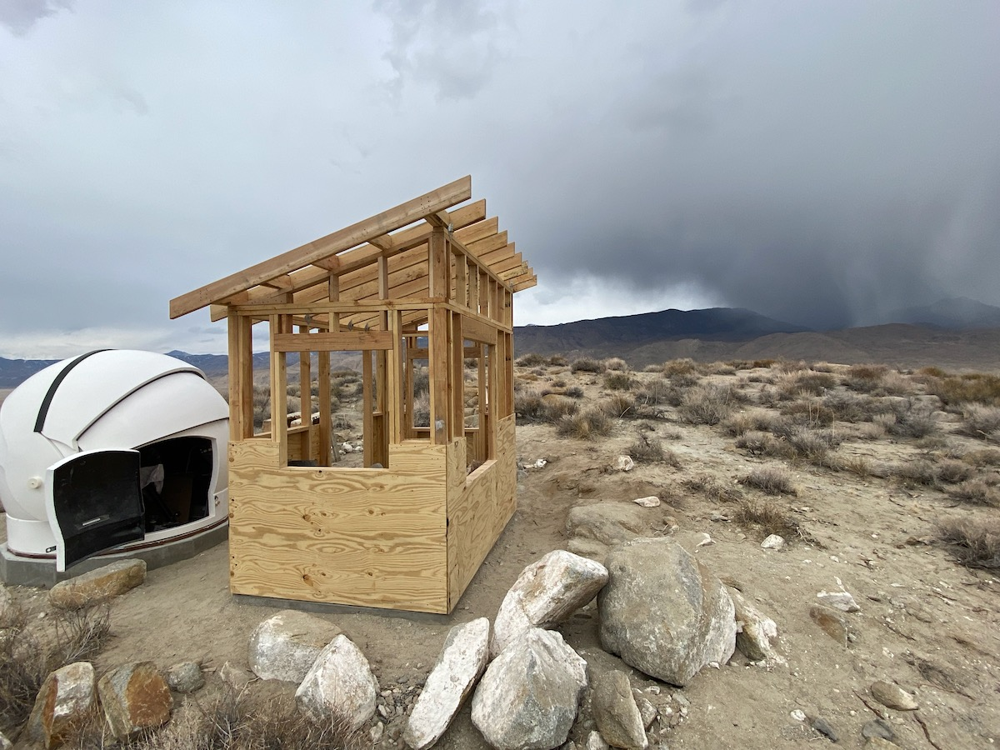

## Index to Plans

### Dome Plans

* [Dome Foundation Plan](./DomeFoundationPlan.pdf)
* [Dome Foundation Elevation](./DomeFoundationElevation.pdf)
* [Dome Foundation Calculations](./DomeFoundationCalculations.pdf)
* [Dome Cross-Section (from manufacturer)](./DomeCrossSection.gif)

### Control Room Plans

Various web resources, especially [one on framing basics](https://theinspiringinvestment.com/diy-framing-basics/), were essential, as was drawing the framing in detail before attempting to construct it:

* [Control Room Plan](./ControlRoomPlan.pdf)
* [Control Room Elevations](./ControlRoomElevations.pdf)
* [Control Room Framing](./ControlRoomFraming.pdf)
* [Control Room Framing Details](./ControlRoomFramingDetails.pdf)
* [Control Room Desk](./ControlRoomDesk.pdf)

Using the framing plans and details,
we had an estimate of the materials needs and made the following order:

* [Control Room Lumber Order](./ControlRoomLumber.pdf)

We had to do an additional lumber run for rafters and pressure-treated fascia, and for two sheets of furniture-grade plywood which were laminated to build the custom desk.

A steady stream of experienced advice from Eric Brown (good friend and Texas homebuilder), and also Ken Carpenter and Gary Schley (of Ken Carpenter Construction), helped keep the project from turning into a collage of newbie mistakes. Astronomers Geoff Marcy and Hans de Moor also steered our choices.

