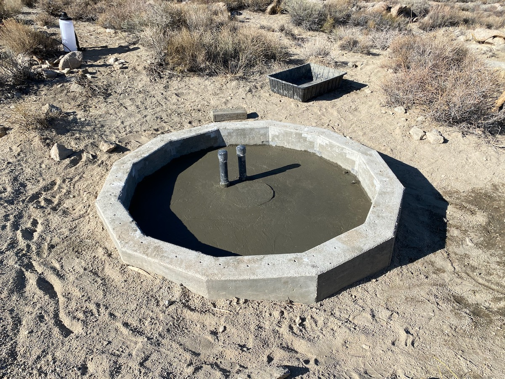

## Index to Plans

### Dome Plans

* [Dome Foundation Plan](./DomeFoundationPlan.pdf)
* [Dome Foundation Elevation](./DomeFoundationElevation.pdf)
* [Dome Foundation Calculations](./DomeFoundationCalculations.pdf)
* [Dome Cross-Section (from manufacturer)](./DomeCrossSection.gif)

### Control Room Plans

Various web resources, especially this one on [framing basics](https://theinspiringinvestment.com/diy-framing-basics/), were essential
given that this was our first building project, as was drawing the framing in detail before attempting to construct it:

* [Control Room Plan](./ControlRoomPlan.pdf)
* [Control Room Elevations](./ControlRoomElevations.pdf)
* [Control Room Framing](./ControlRoomFraming.pdf)
* [Control Room Framing Details](./ControlRoomFramingDetails.pdf)
* [Control Room Desk](./ControlRoomDesk.pdf)

Using the framing plans and details,
we had an estimate of the materials needs and made the following order:

* [Control Room Lumber Order](./ControlRoomLumber.pdf)

The materials needs were padded by 20&#37; to account for warped or damaged lumber
and for framing errors. In fact, although the lumber was green and a little warped so much that it was unusable, it was overall of high quality. Also, we made fewer-than-expected mistakes. The exception to this was that we used every rafter and did not allow enough rafter material for the rafter ladders. We had to do an additional lumber run for rafters and pressure-treated fascia, and for two sheets of furniture-grade plywood which were laminated to build the custom desk.

